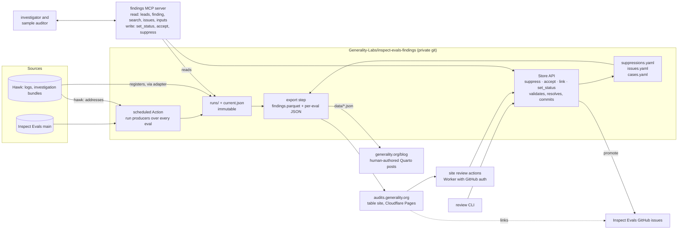

# v1 architecture: one store, two products

Written 2026-10-05 after Matt and Justin agreed that a filter-and-sort table of findings across every eval is the key view. This records how v1 runs, where the findings store lives, how the table site and the blog relate to it, and the decisions still open. The [roadmap](roadmap.md) milestones 3 and 4 are cut around it.

## The shape

Everything that finds problems writes to one store. Everything that shows them reads from it. The two public products are different renderings of the same records, not different data.

The review files are the persistence format, not the interface. Every decision goes through the Store API, which resolves what the reviewer pointed at into fingerprints, validates, writes the files and commits with the reviewer as author. Three clients sit on it: a CLI, review actions on the table site, and an MCP server for the agents.

## The store

A private GitHub repository, `Generality-Labs/inspect-evals-findings`, holding:

- `runs/` and `current.json` per eval, written by the scheduled run and by investigation imports. Immutable; a sweep appends and moves the pointer. Hundreds of kilobytes per eval per run, which git handles for a long time.
- `suppressions.yaml` and `issues.yaml`, written by the Store API on behalf of a reviewer or an agent, so every decision has an author, a reason and blame. Nobody edits them by hand or types a fingerprint.
- `cases.yaml`, the labelled defects the measurement runs against.
- `export/`, rebuilt on every merge: `findings.parquet`, `runs.parquet`, one JSON per eval, and an index JSON. The export is what leaves the repo.

Why git and not R2 now: the review files want PRs; provenance is free; access control is the repo's; the data is small. R2 is where the export is published, and where the store moves only if runs grow past what git handles comfortably. Logs and evidence bundles stay on Hawk and are referenced by `hawk:` address with a checksum; the store never copies them.

## How it runs

1. **Scheduled run.** A GitHub Action in the findings repo, nightly, checks out Inspect Evals main, runs the deterministic producers over every eval (lint, dataset scans through each eval's task, header checks for the evals whose logs are on Hawk, resolved by `--hawk-task`), writes the runs and `current.json`, and commits. Exit code 1 (a producer skipped) is normal; the run records why.
2. **Review.** Through the Store API, never by hand. Four operations: suppress (rule, subject, reason), accept (a group or a set of findings, title), link (issue id, GitHub URL), set status (finding, status, reason). Promote is one action: accepting a candidate files the GitHub issue on Inspect Evals and records the link in the same step. Clients: the `review` CLI for us; review actions on the table site for maintainers, behind a small Worker with GitHub auth that commits as a bot (the blog's comments Worker under `review/` is the in-house precedent); the MCP server for agents. A `review-findings` skill drafts suppressions and acceptances with reasons for a sweep and opens the PR for a person to approve, which is the fast path over 130 evals. Writes open PRs at first; suppressions move to direct commits once the pattern is trusted. The export rebuilds on merge.
3. **Investigations.** Run on Hawk as now, publishing bundles to Hawk's S3. The register adapter imports `findings.json`, `assessments.json` and `coverage.json` into the findings repo as a PR, citing the bundle by address. Where an investigation cited leads by record id, the import writes status history on those observations.
4. **Leads, live.** The investigator and sample auditor attach the findings MCP server. Read tools: `leads(eval, sample_id=None)` (what `LEADS.md` renders today), `finding(record_id)`, `search(eval, rule, status, producer)`, `issues(eval)`, `inputs(eval)`. Write tools: `set_status(record_id, status, evidence, reason)`, `accept`, `suppress`, with provenance set to the agent's run id, so confirming or retiring a lead writes status history as it happens instead of being parsed out of a register later. The server records what it served into the run's inputs, so a run's leads are reproducible. `LEADS.md` stays as a cached copy under `/inputs/findings/` for runs that cannot reach the server. An investigation of an eval the store has not seen, or at a revision other than the nightly's main, does not start empty: the prepare step ensures a current view exists for that eval at the snapshot revision, running the deterministic producers itself if it does not (seconds for lint, minutes for a dataset scan) and writing the runs into the store, and the MCP `leads` tool does the same lazily. Leads always come from the revision under investigation, never from last night's main, so a line number the agent is given is a line number in the code it is reading. An eval outside Inspect Evals gets whatever producers can run against its checkout; the rest are skips with reasons under "Not examined". Local runs use stdio MCP over the checkout with no network; Hawk runs need the server's host on the egress allowlist and a token scoped to the findings repo in the runner, both James's call. The attach step and skill text are a PR to him.
5. **Export and deploy.** The export step runs on merge and publishes to the table site. Blog posts pull the JSON they need into their `data/` directories by hand, as the BixBench post already does with `audit_matrix.json`.
6. **Measurement.** The fortnightly rule-mining track runs `measure` against `cases.yaml` and records the table in the repo. It is not on the site.

## The table site

A small static site at `audits.generality.org`, in its own repository, deployed with Cloudflare Pages from the worker template. Separate from `Generality-Labs.github.io`, whose Quarto pipeline is for essays.

- **Index.** One row per finding across every eval, filterable and sortable on eval, producer, dimension, check, severity, status, reviewed (issue id or none), first seen, last seen. Default sort: accepted issues first, then raw observations grouped by rule with counts. A second index of evals: counts by severity, accepted issues, last successful run, which producers ran.
- **Eval page.** The Inputs section (what was scanned, which logs, what skipped), the grouped findings, the Suppressed and Issues sections, the Assessment table and Coverage where an investigation exists, links to the investigation bundle and to GitHub issues. No grade.
- **Honesty columns.** Every row shows who found it and whether a person has looked. Every eval page shows the date of the last successful run and the checks that did not run. A page with no findings must be distinguishable from a page nobody checked.
- **Voting.** Reactions on the promoted GitHub issues for now. No custom service in v1.
- **Data path.** Pre-rendered JSON per eval plus the index JSON, read by a React table. DuckDB-WASM over the parquet is an option if filtering across the whole corpus in the browser becomes slow; start without it.

## The blog

Unchanged as a product. Posts are human-authored Quarto documents with an argument, framing and a grade written by a person, which is what the strategy doc requires. They import exports from the store into `data/`: per-question verdicts (the audit matrix), assessment tables, example lists. The schema holds one sentence per finding and the producer's own text; it does not hold document-level prose, because a generated post is a future renderer over records plus a human overview, not a schema field.

## What goes in the table

Everything active, with provenance as columns, nothing gated behind the investigator. The deterministic producers are the only thing that covers 130 evals this quarter; routing their output through the investigator would leave the site mostly empty. The table is honest through its columns: a lint observation reads as a lint observation, an accepted issue reads as accepted, an investigator-confirmed lead carries its status history. A user who wants only reviewed problems filters on the issue column.

## v1 scope

The table site over the deterministic producers for every eval, review files applied, accepted issues linked to GitHub, Inputs and freshness per eval, investigator results shown where they exist (SciCode, chess). Blog posts continue and start importing exports. The measurement runs beside it.

In order: the Store API and the `review` CLI, since a scheduled run's output is useless without a fast way to review it; the findings repo and its scheduled run; the MCP server, which is thin once the API exists; the export; the site with its review Worker; the import of the two existing investigations, which predate the server. The measurement slice follows.

## Open decisions

- Repository name and who has write access to the findings repo. Proposed: `Generality-Labs/inspect-evals-findings`, Matt and Tania.
- Schedule: nightly or weekly. Nightly costs little (lint and dataset scans are minutes per eval) and keeps "last successful run" fresh; start nightly, drop to weekly if Hawk pulls dominate.
- Site domain: `audits.generality.org` or a path on `generality.org`. A subdomain keeps the deploy independent of the Quarto site.
- Whether the export is public (the site reads it directly) or the site is built from it privately and only pages are public. Start with pages only; the parquet becomes public when the standard does.
- Security review of the publication path before the site is public, as the roadmap already requires.
- Bot writes: PRs for a person to approve, or direct commits. Start with PRs; relax suppressions to direct commits once trusted.
- Hawk egress for the MCP server's host and the write token's scope, with James.
